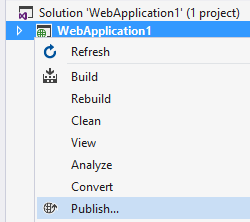
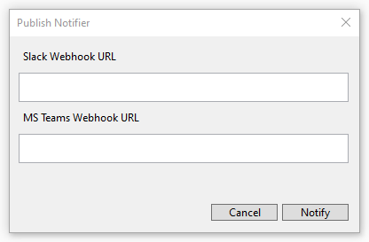
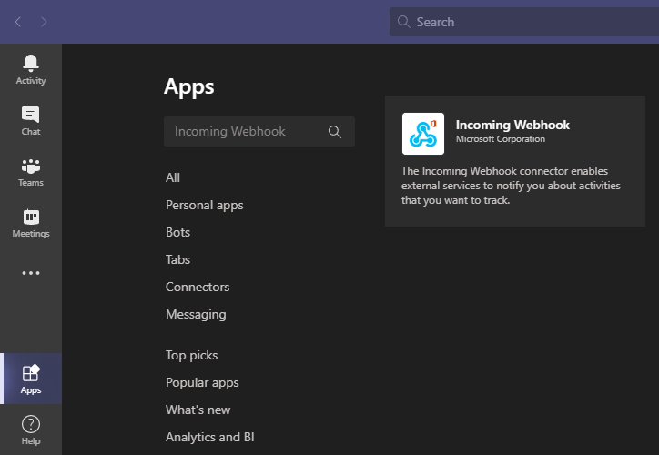
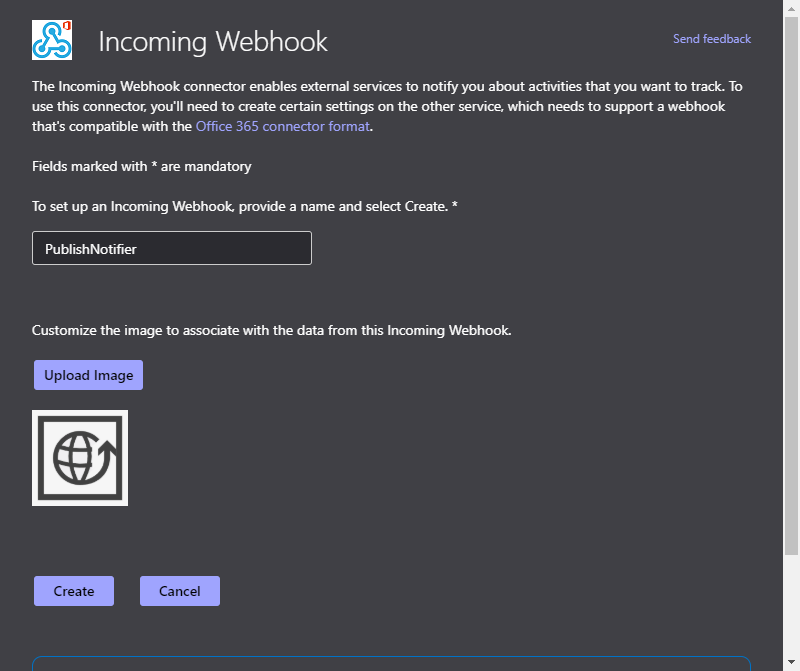
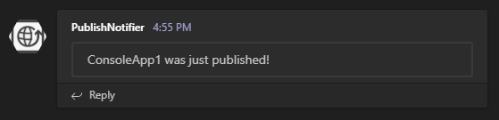

# Publish Notifier

<!-- Update the VS Gallery link after you upload the VSIX-->
Download this extension from the [VS Gallery](https://marketplace.visualstudio.com/items?itemName=dalibormesaric.PublishNotifier)
or get the [CI build](http://vsixgallery.com/extension/763d21f2-0b6e-49d1-ac3c-bd3a74e78566/).

---------------------------------------

Notify your team in Slack or Microsoft Teams when you [Deploy a Web Project Using One-Click Publish from Visual Studio](https://msdn.microsoft.com/en-us/library/dd465337(v=vs.110).aspx) or you just publish to a folder.

See the [change log](CHANGELOG.md) for changes and road map.

## Features

- One-Click Publish sends a notification to your Slack channel and/or Microsoft Teams channel
- The configuration is saved in PublishNotifier.json so you can commit it to source control

### Slack
To enable Slack notifications you have to add a [custom integration](https://slack.com/apps/build/custom-integration) and choose *Incoming WebHooks*. Then choose a Channel where you would like to see notifications and click *Add Incoming WebHooks integration*. Copy the Webhook URL to the Publish Notifer dialog that shows up after you Publish an application.

You may use [this image](./PublishNotifier/Resources/Preview.png) to customize the icon that is used for messages.

### Microsoft Teams
To enable Microsoft Teams notifications you have to add an *Incoming Webhook* connector. You can do this by choosing *Apps > Search all apps > Incoming Webhook*. Follow the process by selecting *Add to a team > Type a team or channel name > Set up a connector*.

Choose *PublishNotifier* as a name and you can even use [this image](./PublishNotifier/Resources/Preview.png) to customize the notification message. By clicking *Create* you will get a *Webhook URL*, copy it and save for later.

If you are on the free tier of Microsoft Teams, use the same process to edit your connectors.

## Contribute
Check out the [contribution guidelines](CONTRIBUTING.md)
if you want to contribute to this project.

For cloning and building this project yourself, make sure
to install the
[Extensibility Essentials 2019](https://marketplace.visualstudio.com/items?itemName=MadsKristensen.ExtensibilityEssentials2019)
extension for Visual Studio which enables some features
used by this project.

## License
[Apache 2.0](LICENSE)