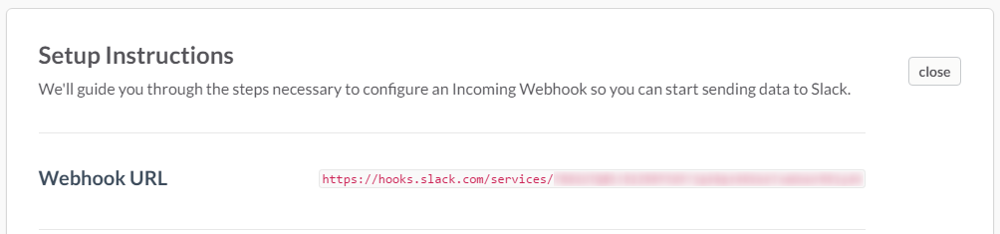
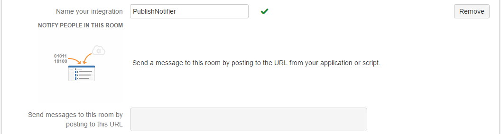

# Publish Notifier

<!-- Update the VS Gallery link after you upload the VSIX-->
Download this extension from the [VS Gallery](https://visualstudiogallery.msdn.microsoft.com/[GuidFromGallery])
or get the [CI build](http://vsixgallery.com/extension/763d21f2-0b6e-49d1-ac3c-bd3a74e78566/).

---------------------------------------

Notify your team in Slack or HipChat when you do a right-click Publish from Visual Studio.

See the [change log](CHANGELOG.md) for changes and road map.

## Features

- Visual Studio Publish posts notification in Slack and/or HipChat

### Slack
To enable Slack notifications you have to add a [custom integration](https://slack.com/apps/build/custom-integration) and choose *Bots*. Create a new bot with a name *PublishNotifier*, and copy the API token to the Publish Notifer dialog that shows up after you Publish an application. You also have to add the bot to the channels where you would like to see notifications.

### HipChat
To enable HipChat notifications you have to add an [integration](https://hipchat.com/addons/) and room where you would like to see notifications. Create a new integration with a name *PublishNotifier*, and copy the URL for posting messages to the Publish Notifer dialog that shows up after you Publish an application.

## Contribute
Check out the [contribution guidelines](CONTRIBUTING.md)
if you want to contribute to this project.

For cloning and building this project yourself, make sure
to install the
[Extensibility Tools 2015](https://visualstudiogallery.msdn.microsoft.com/ab39a092-1343-46e2-b0f1-6a3f91155aa6)
extension for Visual Studio which enables some features
used by this project.

## License
[Apache 2.0](LICENSE)