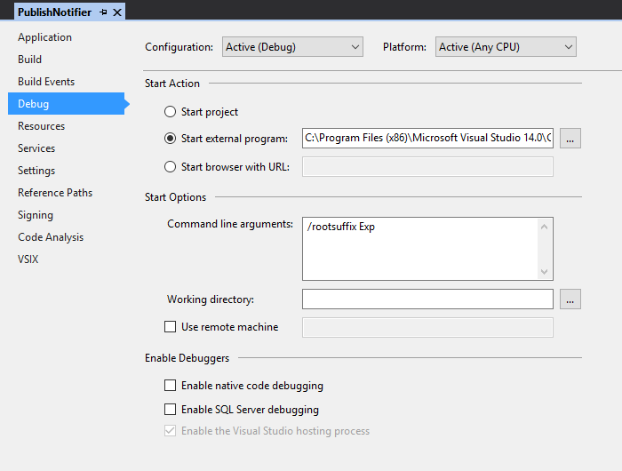

# Dev Setup

To test the extension on different verions of Visual Studio you have to modify Project Properties.



 - Start external program *(point to the specific version of Visual Studio)*:
```
C:\Program Files (x86)\Microsoft Visual Studio 14.0\Common7\IDE\devenv.exe
```
 - Command line arguments:
```
/rootsuffix Exp
```